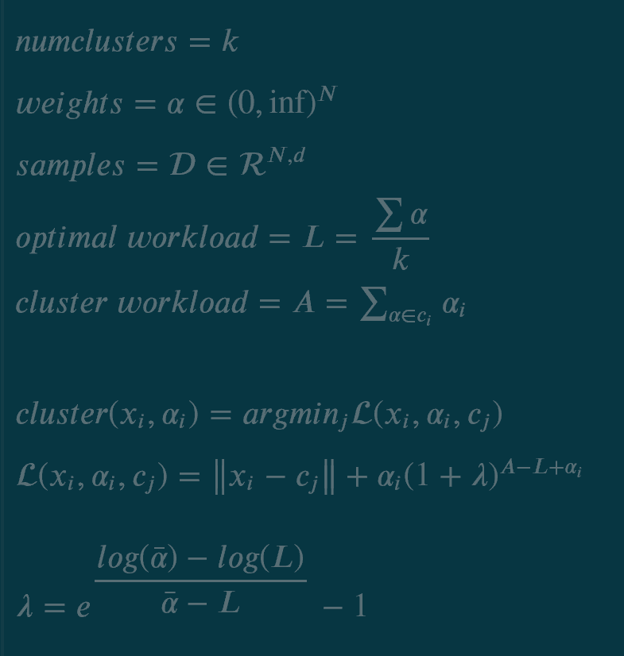
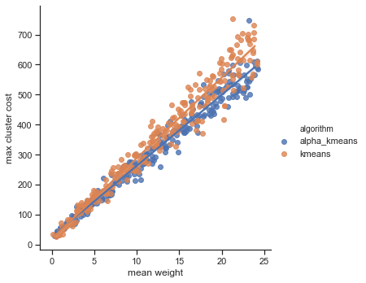
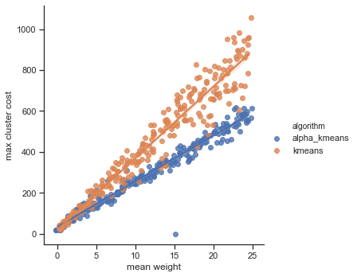
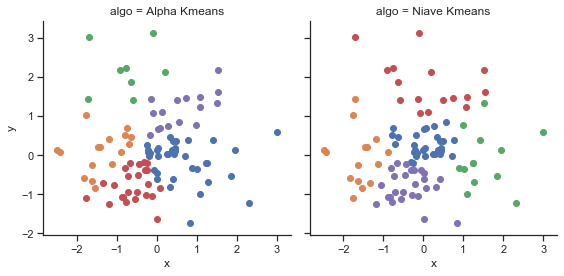

# Alpha-means:
#### A technique for balanced clustering with k-means
<hr>

I designed this algorithm as a faster, easier-to-use replacement for the go-to balanced clustering solution, N-cut, for application in delivery optimization. It uses the K-means cost formula to assign cluster centers minimizing the L2-norm between intra-cluster data. Additionally, my solution employs a second cost formula which seeks to balance the size of each cluster based on the weight of each sample in the cluster. The balancing formula must assign points greedily while still seeking a well-balanced solution, which is an NP-hard problem. 

Critically, the weigth of each sample must only be a positive value, so sample weights can represent the expected time a job/deliver will take, while the sample features can represent its geographical location. My algorithm then finds optimal clusters such that each cluster has a balanced and minimized total cost in terms of travel time and work time, which can be extended to represent the optimal sets of jobs for k workers such that the time taken to solve the system is minimized. 

My modified greedy assignment function is shown below. <br><br>
<br>

Cluster assignment is performed greedily by assigning a sample to the minimum cost cluster, as calculated by the sample features, the sample weight, and the cluster features. The balancing portion of the loss function determines the cost of assigning the weight a new sample to a cluster, which increases exponentially according to parameter $\lambda$ when the optimal cost of a cluster is exceeded. The provided equation for $\lambda$ ensures the balancing penalty remains proportional in terms of the distribution of sample weights.

The assignment function can be used instead of L2-norm in the K-means algorithm, except for a couple of modifications:
```
initialize k centers with plus-plus algorithm
initialize dataset

for each iteration:
    set each cluster workload to 0
    
    for each (x_i, a_i) sampled from dataset proportional to the inverse of its weight:
        assign x_i to cluster by minimziing "cluster" equation
        increment assigned cluster's workload by weight a_i
    
    move each center to mean of cluster
    if configuration is stable:
        break   
```
My algorithm uses the k-means outline, but the order that datapoints are assigned to a cluster is made stochastic, since their assignment depends on the workload accumulated by each cluster at the time of assignment. I found assigning the smaller-weighted datapoints first produces better results, so datapoints are sampled from the dataset inversely proportional to their weight.

The metric by which I judge the effectiveness of a weighted clustering is the distance cost (intra-cluster distance from points to centroid) plus the weight cost, which is just the sum of the weights in the cluster, to yield the total cost of each cluster. I then take the most costly cluster to represent the overall quality of the system. The rationale behind this representation is that given a fixed-cost system, the most balanced solution will have the lowest maximum sub-system cost. In terms of deliveries, I judge the quality of the clustering based on the cost of the longest route calculated. 

Below, I compare Alpha-means with k-means when clustering data. Each figure shows the max cluster cost vs. the mean of the weight distribution, which increases the importance of the sample weights relative to the fixed distribution of their features. The first figure shows the algorithms competing with sample weights unbiased in terms of the the sample features. In that situtaion, with weights randomly distributed, Alpha-means does not outperform k-means significantly since k-means is likely to produce similarly-sized clusters that are likely to contain similar total weights. 

<br>
Figure 1. Max cluster costs with randomly-distributed features and weights.<br>

The second figure shows the algorithms on biased sample weights, in which the sample weight depends on the features of the sample according to $e^{x_1 + x_2}$. In this application, Alpha-means performs better than k-means, especially when sample weights increase in magnitude relative to relative differences in sample features. This demonstrates the Alpha-means outperforms k-means when either the sample features or weights exibit some kind of bias that reduces the likelyhood that k-means will randomly select balanced clusters.<br>

<br>
Figure 2. Max cluster costs with randomly-distributed features and feature-dependent/biased weights.

Despite the difference in performance on data with biased weights, visual examination of the clusters shows little difference in shape or cohesiveness of clusters. This sample was taken from the plot above, with mean weight = 12.5. <br>
<br>

In conclusion, more investigation is needed to find situations where this technique outperforms current balancing clustering algorithms. I suspect Alpha-means will be most successful as an alternative to N-cut on data which k-means is likely to produce ineffective solutions.


